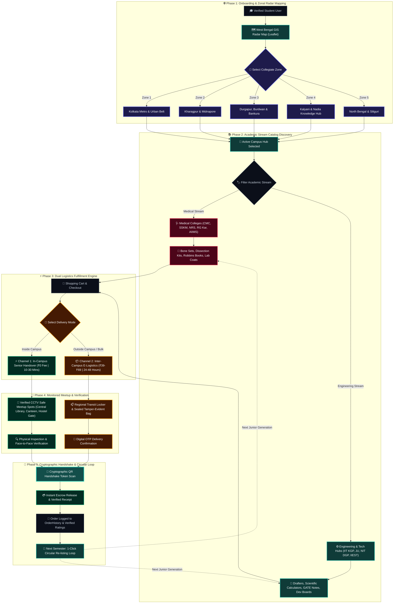

# 🎓 CampusCart — Next-Gen Student Marketplace & Peer Logistics

CampusCart is a specialized collegiate marketplace, peer barter, and skill exchange network built for university and medical college ecosystems. Featuring a modern glassmorphic interface, dark-mode styling, real interactive collegiate zonal radar maps (West Bengal academic clusters), dual delivery logistics (senior in-campus meetup vs. regional e-logistics), and cryptographic handover tokens.

---

## 📁 Repository Structure

The codebase is structured as a modular full-stack application with a Vite + React frontend and a FastAPI backend service:

```text
CAMPUSCART/
├── .gitignore                          # Excludes heavy binaries, node_modules, temp files
├── LICENSE                             # MIT License
├── Makefile                            # Make commands for local dev, build, and tasks
├── package.json                        # Root npm orchestrator scripts
├── package-lock.json                   # Root package lockfile
├── README.md                           # Documentation & project guide
├── index.html                          # Root entry point with instant redirect to frontend
├── backend/                            # FastAPI backend service with MongoDB Atlas
│   ├── requirements.txt                # Python dependencies (FastAPI, Motor, PyMongo, etc.)
│   ├── seed.py                         # Standalone inventory seeding CLI script
│   └── app/                            # Application source code
│       ├── main.py                     # API entry point, CORS & lifespan auto-seeding
│       ├── core/                       # Core configurations
│       │   ├── config.py               # Environment & app settings (Pydantic Settings)
│       │   └── mongodb.py              # Motor async MongoDB connector & ping health check
│       ├── data/                       # Initial data assets
│       │   └── initial_data.py         # 6 initial collegiate products (Medical & Engineering)
│       ├── models/                     # Pydantic schemas
│       │   └── product.py              # ProductCreate, ProductUpdate, ProductResponse models
│       └── routes/                     # REST API route handlers
│           └── products.py             # Full CRUD endpoints (/api/v1/products)
└── frontend/                           # Modern Vite + React 18 Application
    ├── index.html                      # Vite HTML module entry point
    ├── package.json                    # Frontend scripts & dependencies (Leaflet, Lucide, Tailwind)
    ├── package-lock.json               # Frontend lockfile
    ├── vite.config.js                  # Vite bundler configuration
    ├── tailwind.config.js              # Tailwind styling & design tokens
    ├── postcss.config.js               # PostCSS pipeline
    └── src/
        ├── main.jsx                    # React 18 createRoot mount point
        ├── App.jsx                     # Application root state, routing, navbar & modals
        ├── index.css                   # Tailwind directives, custom sliding bars & dark map styling
        ├── data/                       # Static & mock datasets
        │   ├── mockData.js             # Marketplace listings, categories & dummy users
        │   └── westBengalColleges.js   # 23+ colleges (Medical & Engineering), zones & GPS coordinates
        └── components/                 # Modular UI Components & Views
            ├── OverviewGatewayView.jsx   # Pre-login hero showcase & feature breakdown
            ├── HomrPageIdeaView.jsx      # Post-login marketplace dashboard & live ticker
            ├── MarketplaceView.jsx       # Product catalog grid, search & category filters
            ├── SellItemView.jsx          # Listing creation & item publish form
            ├── SellerDashboard.jsx       # Seller active inventory, listing editor & sales stats
            ├── ServicesView.jsx          # Peer tutoring, student gigs & skill exchange
            ├── CourseView.jsx            # Course materials & past exams exchange
            ├── CartView.jsx              # Shopping cart & checkout token generator
            ├── WishListView.jsx          # Saved wishlist items & price tracking
            ├── OrderHistory.jsx          # Past transactions, pickup tokens & order statuses
            ├── WestBengalMapModal.jsx    # Real Leaflet interactive map with zonal divisions
            ├── CircularWheelShowcase.jsx # Rotating interactive category wheel
            └── VideoShowcase.jsx         # Procedural 60fps canvas visual reel
```

---

## 🌟 Key Features

- **🗺️ Real West Bengal Zonal Radar Map**:
  - Built with Leaflet using **100% free, zero-API-key** tile services (ESRI Dark Canvas & OpenStreetMap).
  - Divided into 5 distinct collegiate zones: **Kolkata Metro**, **Kharagpur & Midnapore**, **Durgapur/Burdwan/Bankura**, **Kalyani & Nadia**, and **North Bengal**.
  - **Stream Filtering**: Instant toggle between **🩺 Medical Colleges** (CMC, SSKM, NRS, RG Kar, CNMC, AIIMS Kalyani, Burdwan Medical, Bankura Medical, Midnapore Medical, NBMCH, Malda Medical) and **⚙️ Engineering & Tech Hubs** (IIT KGP, JU, NIT DGP, IIEST, KGEC, UIT, etc.).
  - **Fluid Sliding Bar & Responsive Controls**: Pinned active campus hub button, compact `+` / `−` zoom controls, and smooth `flyTo` navigation.

- **⚡ Dual Delivery Logistics**:
  - **In-Campus (Direct Senior Handover)**: ₹0 fee, 10–30 min meetup at verified CCTV safe spots (libraries, main gates, central canteens).
  - **Out-of-Campus / Bulk (E-Logistics)**: Inter-district transit (24–48 hours) for off-campus scholars and bulk study bundles.

- **🛍️ Complete Marketplace Flow**:
  - Product listings, item selling wizard, peer tutoring/gigs (`ServicesView`), course materials archive (`CourseView`), wishlist bookmarking (`WishListView`), and order history with digital pickup token codes (`OrderHistory`).

---

## 🔄 Interactive Project Workflow & Architecture

The following diagram illustrates CampusCart's end-to-end lifecycle—from institutional geo-location and stream filtering, through the dual-fulfillment routing engine, to the cryptographic QR handshake and circular re-listing loop:



<br/>

### 📱 Interactive Lifecycle Stages (Click to Expand)

<details open>
<summary><b>🗺️ Stage 1: Institutional Onboarding & GIS Radar Pinning</b></summary>
<br/>

- **Campus Radar Mapping**: Students launch the high-contrast Leaflet map powered by zero-API-key **ESRI Dark Canvas** and **OpenStreetMap** layers.
- **5 Zonal Divisions**: Real-time coverage across **Kolkata Metro**, **Kharagpur / Midnapore**, **Durgapur / Burdwan**, **Kalyani / Nadia**, and **North Bengal**.
- **Dynamic Fly-To Navigation**: Clicking any zone or campus executes smooth camera gliding with polygon boundary highlights and student population counters.

> [!NOTE]
> All collegiate data includes verified geolocation coordinates (WGS84 Lat/Lng), pincodes, and active student verification badges.
</details>

<details>
<summary><b>🩺 Stage 2: Academic Stream Specialization & Inventory Barter</b></summary>
<br/>

- **Medical & Healthcare Stream**: High-demand circulation of human osteology bone sets, anatomy dissection manuals, stethoscope kits, and clinical surgery books across Calcutta Medical College, IPGMER/SSKM, NRS, RG Kar, AIIMS Kalyani, and Burdwan Medical.
- **Engineering & Technology Stream**: Rapid semester trade of mini-drafters, Casio fx-991EX calculators, GATE study bundles, and micro-controller dev boards across IIT Kharagpur, Jadavpur University, NIT Durgapur, IIEST Shibpur, and KGEC.
- **Peer Tutoring & Student Gigs**: Direct peer exchange of semester exam revision sessions, CAD drafting assistance, and coding tutoring.
</details>

<details>
<summary><b>⚡ Stage 3: Dual-Channel Fulfillment Engine</b></summary>
<br/>

CampusCart dynamically bifurcates order routing based on collegiate proximity and order weight:

| Metric | Channel 1: In-Campus Senior Handover | Channel 2: Regional Inter-Campus E-Logistics |
| :--- | :--- | :--- |
| **Delivery Cost** | **₹0.00 (100% Free Peer Meetup)** | **₹39 – ₹69 (Free on Bulk > ₹499)** |
| **ETA** | **10 – 30 Minutes** | **24 – 48 Hours** |
| **Fulfillment Agent** | Senior student / batchmate on campus | Regional collegiate courier & transit lockers |
| **Location** | Verified CCTV landmark safe spots | Off-campus home address or campus locker |
| **Packaging** | Zero waste (hands-on peer handover) | Tamper-evident sealed barcode bag |
| **Ideal For** | Urgent exam books, single calculators, lab coats | Bulky semester book sets, cross-city transfers |
</details>

<details>
<summary><b>🛡️ Stage 4: CCTV-Monitored Safe Zones & Physical Verification</b></summary>
<br/>

- **Eliminating Stranger Risk**: Unlike generic classifieds (OLX) that force students to meet unknown people off-campus, CampusCart enforces transactions at monitored collegiate landmarks:
  - *Jadavpur University*: World View Staff Canteen, Subarna Jayanti Bhavan Lawn.
  - *Calcutta Medical College*: Council Hall Portico, Administrative Lawn.
  - *IIT Kharagpur*: Tech Market Clock Tower, Central Library Steps.
  - *NIT Durgapur*: Student Activity Center (SAC), Hall 11 Entrance.
- **Pre-Payment Inspection**: The buyer examines the physical condition, page markings, and instrument calibration before authorizing payment.
</details>

<details>
<summary><b>🔐 Stage 5: Cryptographic QR Handshake & Circular Loop</b></summary>
<br/>

- **Dynamic QR Handshake**: The seller displays a time-sensitive, single-use encrypted QR token generated by the checkout engine.
- **Instant Escrow Settlement**: The buyer scans the token via CampusCart, instantly confirming physical custody and releasing funds or peer barter credits.
- **The Circular Economy Engine**: When the junior completes that semester's examinations, the item is preserved in their `OrderHistory` with a **"Re-list for Next Batch"** button, creating an infinite, sustainable circular inventory loop.
</details>

---

## 🚀 How to Run Locally

### Prerequisites
- **Node.js**: `v18.0.0` or later ([Download Node.js](https://nodejs.org/))
- **Python**: `3.10` or later (for local backend) ([Download Python](https://www.python.org/))
- **MongoDB Atlas account or local MongoDB** (if running backend locally)

---

### Option A: Quickstart (Frontend with Live Cloud Backend) — *Recommended*

The frontend is already pre-configured to connect to the live production FastAPI + MongoDB Atlas backend hosted on Render (`https://campuscart-6m90.onrender.com`). You can launch the full application locally in seconds without setting up Python or MongoDB:

```bash
# 1. Clone repository
git clone https://github.com/Sowmajit-Kar/CAMPUSCART.git
cd CAMPUSCART

# 2. Install frontend dependencies
npm run install:frontend
# or: cd frontend && npm install

# 3. Start Vite development server
npm run dev
# or: cd frontend && npm run dev

# 4. Open in your browser:
# http://localhost:3000 (or http://localhost:5173)
```

---

### Option B: Full-Stack Local Development (Frontend + Local FastAPI Backend)

To run both the Python FastAPI backend and Vite React frontend locally:

#### Step 1: Start the Backend (FastAPI + MongoDB)

```bash
# 1. Navigate to backend
cd backend

# 2. Create & activate a virtual environment
# Windows (PowerShell):
python -m venv venv
.\venv\Scripts\activate

# macOS / Linux:
# python3 -m venv venv
# source venv/bin/activate

# 3. Install Python dependencies
pip install -r requirements.txt

# 4. Create a .env file inside backend/ (optional, defaults to safe fallbacks)
# MONGO_URI=mongodb+srv://<username>:<password>@cluster0.abcde.mongodb.net/campuscart_db?retryWrites=true&w=majority
# MONGO_DB_NAME=campuscart_db

# 5. Start the FastAPI server with auto-reload
uvicorn app.main:app --reload --port 8000

# Backend runs on: http://127.0.0.1:8000
# Interactive Swagger Documentation: http://127.0.0.1:8000/docs
# MongoDB Health Check: http://127.0.0.1:8000/api/v1/health/mongodb
```

> [!NOTE]
> On startup, the FastAPI server automatically connects to MongoDB and seeds 6 collegiate items (Medical Books, Bone Set, Mini Drafter, etc.) if the collection is empty. You can also re-seed manually at any time by running:
> ```bash
> python seed.py
> ```

#### Step 2: Start the Frontend (Pointed to Local Backend)

Open a **new terminal tab**:

```bash
# 1. Navigate to frontend
cd frontend

# 2. (Optional) Point frontend to your local backend
# In frontend/.env or frontend/.env.local:
# VITE_API_URL=http://localhost:8000

# 3. Install dependencies & start dev server
npm install
npm run dev

# Frontend runs on: http://localhost:3000
```

---

### 🌐 Live Production API & Evaluator Links

For teacher evaluations and live viva presentations without running anything locally:

| Resource | URL | Status |
| :--- | :--- | :--- |
| **Interactive Swagger API Docs** | [campuscart-6m90.onrender.com/docs](https://campuscart-6m90.onrender.com/docs) | 🟢 Live |
| **API Health Status** | [campuscart-6m90.onrender.com/api/v1/health](https://campuscart-6m90.onrender.com/api/v1/health) | 🟢 Healthy |
| **MongoDB Atlas Health** | [campuscart-6m90.onrender.com/api/v1/health/mongodb](https://campuscart-6m90.onrender.com/api/v1/health/mongodb) | 🟢 Connected |
| **Products REST Endpoint** | [campuscart-6m90.onrender.com/api/v1/products](https://campuscart-6m90.onrender.com/api/v1/products) | 🟢 8+ Products |

---

### 📡 REST API Endpoints Overview

| Method | Endpoint | Description |
| :--- | :--- | :--- |
| `GET` | `/api/v1/products` | List products (supports `?stream=medical`, `?category=...`, `?search=...`) |
| `GET` | `/api/v1/products/{id}` | Get single product details by MongoDB ID |
| `POST` | `/api/v1/products` | Create a new product listing (used by `/sell`) |
| `PUT` | `/api/v1/products/{id}` | Update product fields (used by `/seller-dashboard`) |
| `DELETE` | `/api/v1/products/{id}` | Delete product (used by `/seller-dashboard` & auto-triggered on QR buy) |
| `POST` | `/api/v1/products/seed` | Seed initial campus items into database |
| `GET` | `/api/v1/health/mongodb` | Instructor viva verification for database connectivity |

---

## 📦 Git & Deployment

CampusCart is configured for automatic deployment on platforms like Vercel or Render.

```bash
# Check status
git status

# Commit and push changes
git add .
git commit -m "feat: your descriptive commit message"
git push origin goat-branch

# To sync with production branch:
git checkout main
git merge goat-branch
git push origin main
git checkout goat-branch
```
